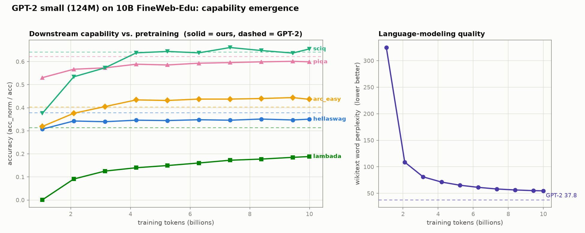

# Evaluation: GPT-2 Small Reproduction

A from-scratch GPT-2 small (124M) trained on **10B tokens of FineWeb-Edu**,
evaluated against the public `gpt2` checkpoint on standard LM benchmarks.

## Training summary

| | |
|---|---|
| Data | FineWeb-Edu `sample-10BT` |
| Tokens | 10B (19,073 steps × 524,288 tokens) |
| Model | 124.5M params (tied embeddings), seq 1024 |
| Optimizer | AdamW (0.9, 0.95), wd 0.1 on ≥2D params, grad clip 1.0 |
| LR | 6e-4 peak, cosine → 6e-5, 700-step warmup |
| Precision | bf16 autocast + SDPA + torch.compile + fused AdamW |
| Hardware | 1× H100, ~201K tok/s, ~13 h |
| Final loss | train 3.27 / val 3.31 (val on a FineWeb-Edu slice) |

## Method

Our custom `Transformer` is converted into an equivalent HuggingFace
`GPT2LMHeadModel` (verified numerically exact: max |logit diff| ~4e-6), then
scored with the EleutherAI lm-evaluation-harness CLI (`--model hf`). See
`benchmarks/eval_lm_harness.py`. Task set chosen so GPT-2 small scores clearly
above chance on each (near-chance tasks like winogrande/arc_challenge/boolq/mmlu
were dropped as uninformative at 124M).

Note: our model uses exact (erf) GELU; the public `gpt2` uses tanh-approx
`gelu_new`. Each is evaluated with its own correct activation.

## Results (0-shot)

| Task | Metric | Ours (10B FineWeb-Edu) | GPT-2 (public) | Winner |
|---|---|---|---|---|
| arc_easy | acc_norm | **0.4348** | 0.3960 | ours +0.039 |
| sciq | acc_norm | **0.6550** | 0.6420 | ours +0.013 |
| hellaswag | acc_norm | 0.2899 | **0.3115** | gpt2 +0.022 |
| piqa | acc_norm | 0.5990 | **0.6224** | gpt2 +0.023 |
| lambada_openai | acc | 0.1875 | **0.3086** | gpt2 +0.121 |
| wikitext | word ppl (↓) | 54.73 | **37.83** | gpt2 |

## Interpretation

A GPT-2-class model whose benchmark profile is the **FineWeb-Edu data
fingerprint**:

- **Wins on knowledge** (arc_easy, sciq) — educational-quality filtering helps
  science/QA.
- **Near-parity on commonsense** (hellaswag, piqa within ~2 pts).
- **Loses on distribution-sensitive tasks** (lambada = narrative books,
  wikitext = encyclopedic) — FineWeb-Edu's aggressive filtering narrows the
  distribution away from these, while GPT-2's broader WebText covers them.

The headline "reproduced GPT-2" metric, hellaswag, lands within ~2 points of
GPT-2. The lambada gap (−0.12) is the most notable shortfall and is largely a
train/eval distribution mismatch.

## Capability emergence over training

`benchmarks/checkpoint_sweep.py` evaluates all 10 checkpoints (every 2000 steps
+ final) on the task set and plots each metric vs. training tokens, with public
GPT-2 as a dashed reference.



Three distinct regimes appear:

1. **Knowledge (sciq, arc_easy) — rise fast, cross *above* GPT-2, plateau.**
   The FineWeb-Edu advantage is banked early (sciq passes GPT-2 by ~4B tokens).
2. **Commonsense (hellaswag, piqa) — rise then plateau *just below* GPT-2.**
   hellaswag is dead flat after ~2B tokens. The plateau means more FineWeb-Edu
   tokens would **not** close this gap — it's a data-*distribution* ceiling, not
   a compute/budget limit.
3. **Distribution-sensitive (lambada, wikitext) — still improving at 10B.**
   lambada climbs from ~0.001 to 0.19 and wikitext perplexity from 325 to 54.7,
   both still moving. These are budget/breadth-limited: more (and broader) data
   would keep helping.

Takeaway: parity with GPT-2 on commonsense was a genuine ceiling for this data,
knowledge was won outright, and the lambada/wikitext gaps are the fixable
(under-trained / distribution-mismatched) ones.

Note: the sweep uses `--limit 2000` (first 2000 examples/task) for speed, so its
absolute values run slightly high vs. the full-set numbers above; trends and the
ours-vs-GPT-2 relative gaps are valid (GPT-2 is scored on the same subset).

## Reproduce

```bash
# Train (1× H100, ~13 h)
python demos/train_gpt2_fineweb.py

# Evaluate ours vs. public gpt2
python benchmarks/eval_lm_harness.py \
  --checkpoint /mnt/localssd/gpt2/checkpoints/ckpt_final.pt

# Public gpt2 baseline only
python benchmarks/eval_lm_harness.py --gpt2-only

# Capability-vs-tokens sweep over all checkpoints (+ plot)
python benchmarks/checkpoint_sweep.py --checkpoint-dir /mnt/localssd/gpt2/checkpoints
```

## Sample generations (trained model, top-k=40, temp 0.8)

> The process of photosynthesis is the most efficient form of chemical exchange
> and provides multiple benefits in agricultural production. It involves
> converting sunlight into electrical energy...

Fluent, on-topic English with visible educational-domain tilt; semantically
shaky as expected at 124M scale.
