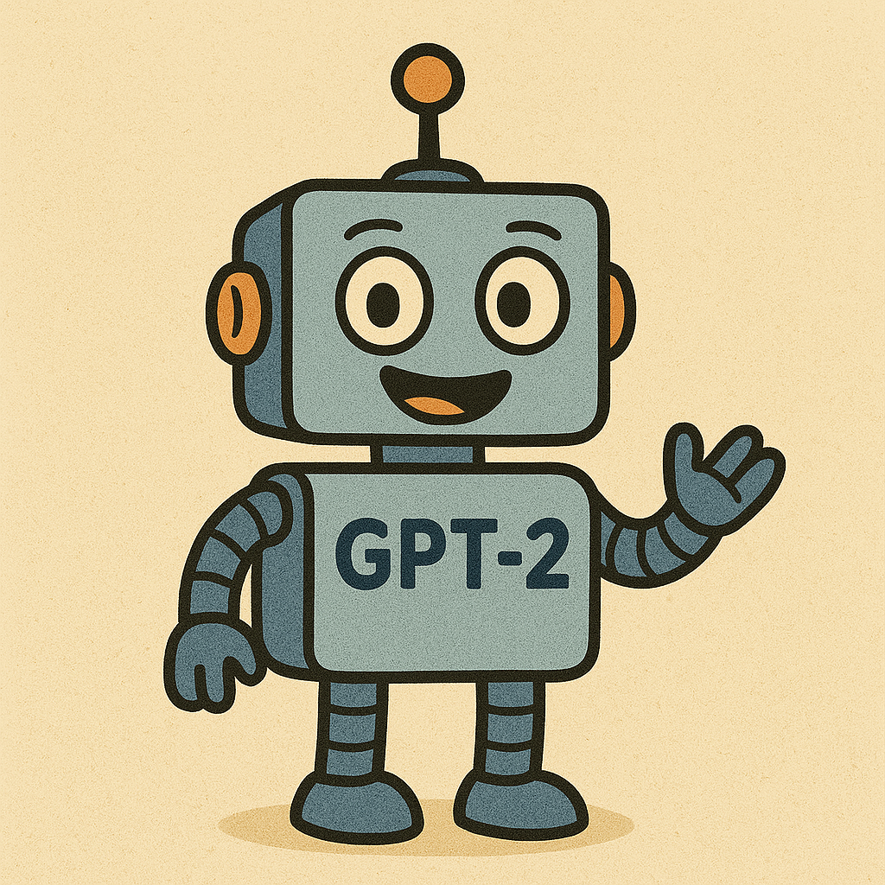

# GPT-2 Small Implementation

This repository contains a clean PyTorch implementation of a GPT-2 style transformer model. The implementation is based on the architecture described in the "Attention Is All You Need" paper, with modifications specific to GPT-2.

## Overview

The codebase demonstrates how to build a transformer-based language model from scratch, including:

- Multi-head self-attention
- Layer normalization
- Feed-forward (MLP) layers
- Token and positional embeddings
- Autoregressive text generation

## Project Structure

- `solution.py`: Main implementation of the GPT-2 model components and training functions
- `gpt2_small/`: Python package that wraps the implementation for easy import
- `tests/`: Test suite to validate model components
- `demos/`: Demonstration scripts for training and text generation
- `pyproject.toml`: Project configuration and dependencies (used for installation)
- `setup_env.sh`: Scripts to setup virtual environment and install the package

## Setup

### Prerequisites

- Python 3.8 or higher
- pip (package installer for Python)

### Setting Up Environment

#### On Linux/macOS:

```bash
# Make the script executable
chmod +x setup_env.sh

# Run the setup script and activate the environment
./setup_env.sh
```

### Package Installation

The project is set up as a Python package that can be installed with pip:

```bash
# Install in development mode (changes to the code will be reflected immediately)
pip install -e .

# Install with development dependencies
pip install -e ".[dev]"
```

After installation, you can import the components from the package:

```python
from gpt2_small import Transformer, TransformerConfig
```

## Model Components

The implementation includes these key components:

- `TransformerConfig`: Configuration class for model hyperparameters
- `MultiHeadAttention`: Implementation of masked multi-head self-attention
- `LayerNorm`: Layer normalization implementation
- `MLP`: Feed-forward network used in transformer blocks
- `TransformerBlock`: Full transformer block (attention + MLP)
- `Embedding`: Token embedding lookup
- `PositionalEmbedding`: Position encoding
- `Unembedding`: Linear projection from model dimension to vocab
- `Transformer`: Top-level model class that combines all components

## Usage

### Testing Model Components

Run the test suite to verify all model components:

```bash
python test_model.py
```

### Training the Model

The implementation includes functions for training a transformer model. Two approaches are available:

```bash
python ./demos/train_demo.py
```

The training demo:
- Creates a small model suitable for quick training
- Shows generation samples before training begins
- Trains the model on a simple dataset
- Displays generation samples throughout training to show progress
- Tracks loss metrics and generation quality improvement

### Generating Text

The implementation includes functions for generating text from the model:

```bash
# Run the comprehensive generation demo
python ./demos/generate_demo.py
```

The generation demo showcases:
- Generation with a randomly initialized model
- Generation with different temperature settings (controlling randomness)
- Generation with top-k sampling (limiting the token selection pool)
- Generation with pre-trained weights when available

The demos are designed as - they demonstrate all components working together correctly and produce outputs that can be evaluated visually.

## Demonstration Scripts

The `demos/` directory contains scripts designed to demonstrate the capabilities of the implementation with human-readable outputs:

## Requirements

- PyTorch
- transformer_lens
- einops
- datasets
- matplotlib (for visualization)
- jaxtyping (for type annotations)

## References

- [Attention Is All You Need](https://arxiv.org/abs/1706.03762) - Original transformer paper
- [GPT-2: Language Models are Unsupervised Multitask Learners](https://cdn.openai.com/better-language-models/language_models_are_unsupervised_multitask_learners.pdf) - GPT-2 paper
